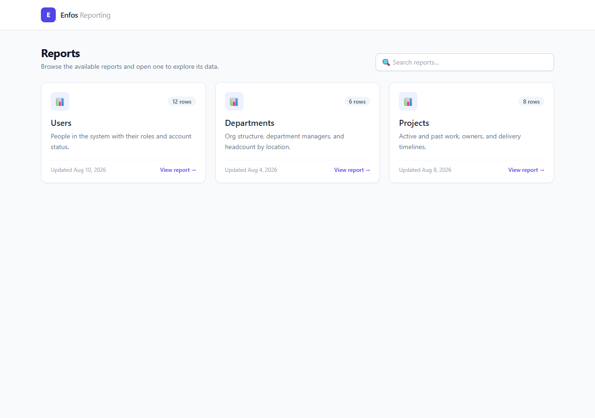
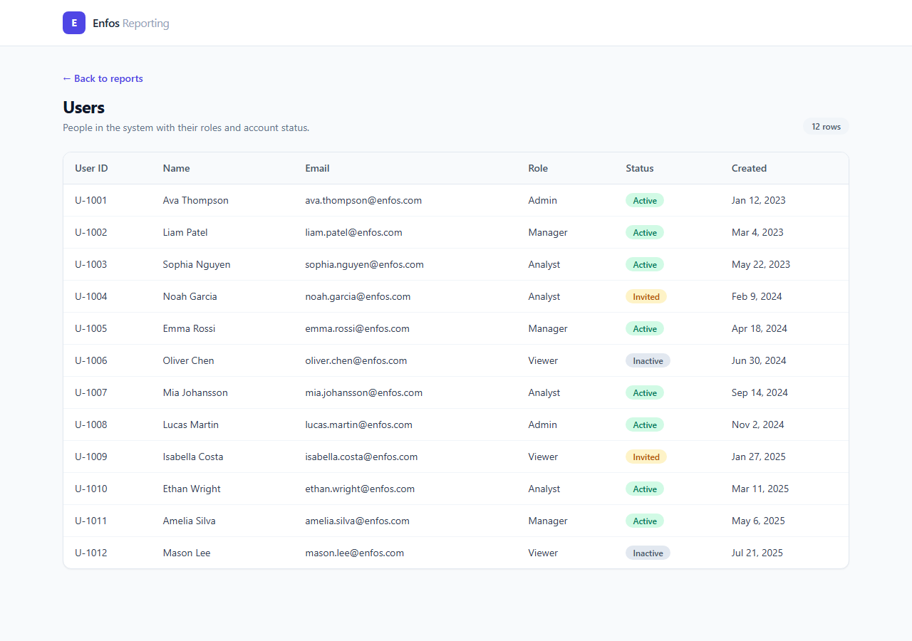
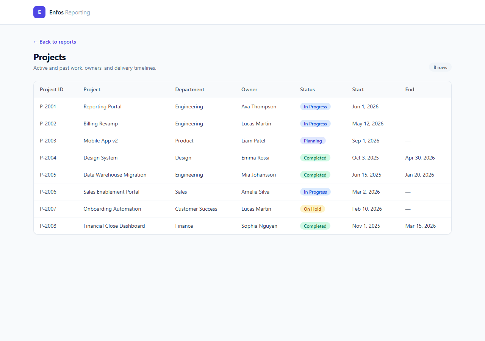
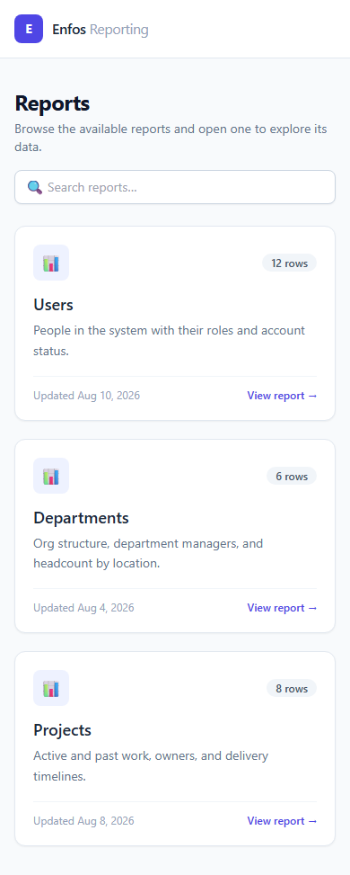

# Enfos Reporting Portal

A small but complete full-stack reporting portal. Users land on a homepage listing
the available reports, search for one, and open it to explore its data in an
interactive table — with proper loading, empty, and error states throughout.

- **Frontend:** React + TypeScript + Vite + Tailwind CSS
- **Backend:** Java 21 + Spring Boot 3 (REST API, in-memory mock data)
- **Run it:** one command — `docker compose up --build`

---

## Screenshots

| Landing page (desktop) | Users report |
| --- | --- |
|  |  |

| Projects report (nullable end dates) | Landing page (mobile) |
| --- | --- |
|  |  |

---

## Quick start (Docker — recommended)

The only prerequisite is **Docker Desktop** (with Docker Compose v2+). From a clean
checkout:

```bash
docker compose up --build
```

Then open **http://localhost:3000**.

This builds two images and starts both services:

- `backend` — Spring Boot API, built with Maven inside the image, runs on port 8080 (internal to the compose network).
- `frontend` — the production React bundle served by nginx on port 3000, which also reverse-proxies `/api` to the backend (so the browser talks to a single origin — no CORS in the deployed setup).

Stop with `Ctrl+C`, then `docker compose down` to remove the containers.

---

## Alternative: run locally without Docker

Useful for development. Prerequisites: **JDK 21** and **Node.js 20+**.

**1. Backend** (from `backend/`) — uses the bundled Maven wrapper, no local Maven needed:

```bash
cd backend
./mvnw spring-boot:run
```

The API comes up on http://localhost:8080.

**2. Frontend** (from `frontend/`, in a second terminal):

```bash
cd frontend
npm install
npm run dev
```

The dev server runs on http://localhost:5173 and proxies `/api` to the backend on
8080 (see `vite.config.ts`), so relative API URLs work exactly as they do in Docker.

---

## API

Base path: `/api`

| Method | Endpoint | Returns |
| --- | --- | --- |
| GET | `/api/reports` | Metadata for all reports (id, name, description, rowCount, lastUpdated) |
| GET | `/api/reports/users` | Users report rows |
| GET | `/api/reports/departments` | Departments report rows |
| GET | `/api/reports/projects` | Projects report rows |

### Reports & columns

- **Users** — User ID, Name, Email, Role, Status, Created Date
- **Departments** — Department ID, Name, Manager, Employee Count, Location
- **Projects** — Project ID, Name, Department, Owner, Status, Start / End Date

---

## Project structure

```
enfos-reporting-portal/
├── docker-compose.yml          # brings up the whole stack
├── backend/                    # Spring Boot API
│   ├── Dockerfile              # multi-stage: Maven build -> slim JRE
│   ├── mvnw / mvnw.cmd         # Maven wrapper (no local Maven required)
│   └── src/main/java/com/enfos/reporting/
│       ├── controller/         # ReportController — REST endpoints
│       ├── service/            # ReportService — mock data + logic
│       ├── model/              # records: ReportSummary, User, Department, Project
│       └── config/             # WebConfig — CORS for the dev server
└── frontend/                   # React + TS + Tailwind
    ├── Dockerfile              # build with Node -> serve with nginx
    ├── nginx.conf              # static hosting + /api reverse proxy + SPA fallback
    └── src/
        ├── api/                # typed fetch client
        ├── components/         # Header, ReportCard, DataTable, SearchBar, StatusBadge, StateViews
        ├── hooks/              # useAsync — shared loading/error/data handling
        ├── pages/              # LandingPage, ReportDetailPage
        ├── reports/            # per-report column definitions
        └── types/              # shared API types
```

---

## Design decisions, assumptions & tradeoffs

**Generic, config-driven table.** `DataTable` is report-agnostic; each report declares
its columns in `src/reports/reportColumns.tsx` (including custom cell renderers for
status badges and formatted dates). Adding a fourth report is a backend endpoint plus
one entry in that config — no new table component. This keeps the components modular
and scalable, which the brief emphasises.

**Centralised data fetching.** A single `useAsync` hook drives every fetch and exposes
`{ data, loading, error, reload }`. Because all data loading flows through it, the
loading, empty, and error states are consistent across the landing page and every
report, and the error state offers a "Try again" retry.

**State handling.** Each view distinguishes four states: loading (spinner), error
(message + retry), empty (no rows, or "no search matches"), and populated. The empty
state on the landing page adapts its message depending on whether a search is active.

**Single origin in production.** Rather than enabling permissive CORS in the deployed
app, nginx serves the frontend and reverse-proxies `/api` to the backend, so the
browser only ever hits one origin. CORS is enabled only for the Vite dev server
(`WebConfig`), where the two run on different ports.

**Backend data layer.** Data is in-memory mock data (the brief allows this; a database
is optional). `ReportService` is deliberately shaped so it could be swapped for a
JPA-backed implementation with the same method signatures, without touching the
controller or the frontend. Domain models are immutable Java `record`s.

**Dates.** The API sends date-only ISO strings (`2026-08-10`); the frontend formats
them for display (`Aug 10, 2026`) and renders a nullable project end date (an ongoing
project) as an em dash.

**Assumptions.** Reports are read-only (no create/update/delete) — this is a reporting
portal. There is no authentication; the brief scopes this to the reporting slice. Data
volumes are small, so filtering/search is done client-side and the full table renders
without pagination or virtualisation — the natural next steps at larger scale.

---

## Testing

Backend integration tests (full application context) assert the HTTP contract the
frontend relies on for all four endpoints:

```bash
cd backend
./mvnw test
```

Frontend type-checking (also run as part of `npm run build`):

```bash
cd frontend
npm run lint
```

---

## Prerequisites summary

| Path | Requires |
| --- | --- |
| Docker (recommended) | Docker Desktop + Compose v2 |
| Local backend | JDK 21 (Maven via the bundled wrapper) |
| Local frontend | Node.js 20+ |
